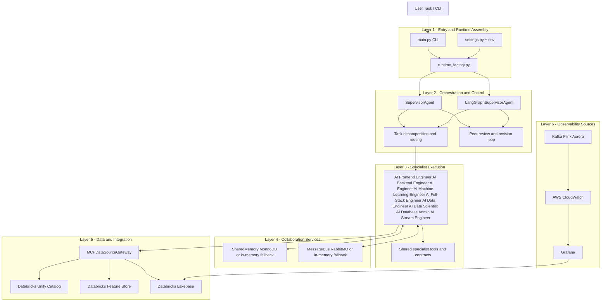
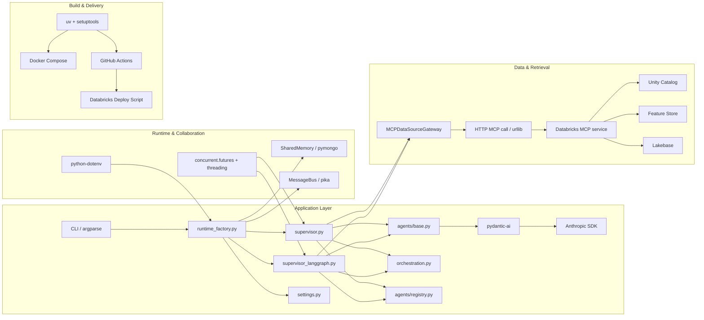
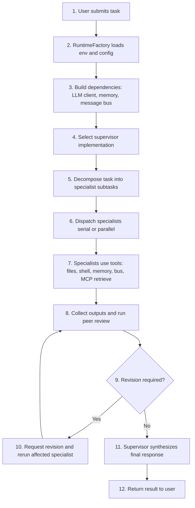
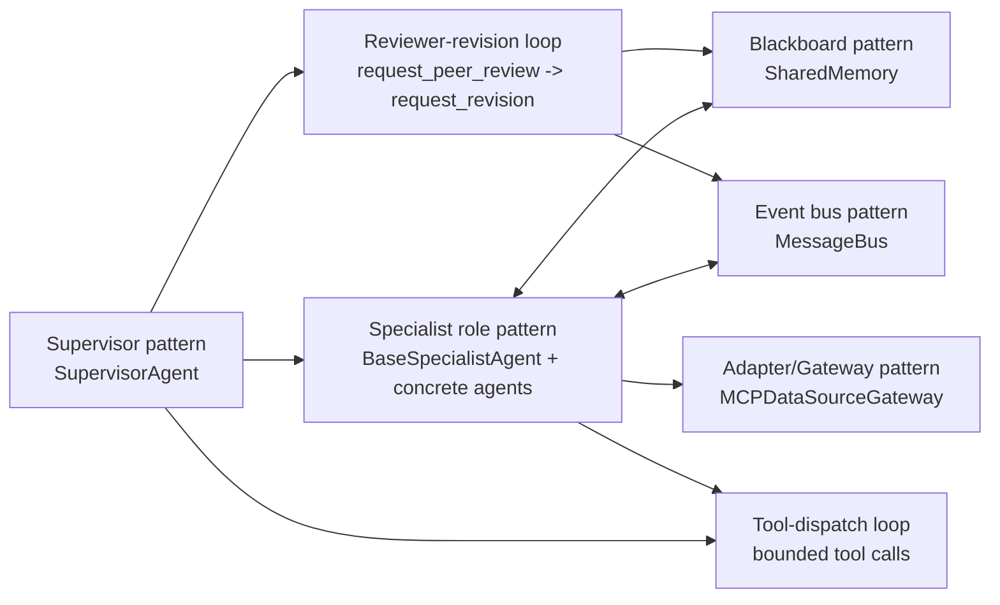
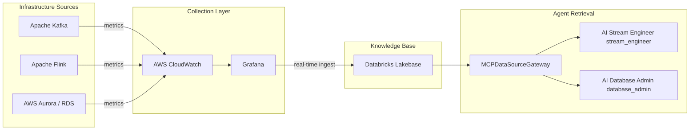

# Architecture

Related decisions are documented in [ADRs](adrs/README.md).

## System Overview

The application uses a supervisor-specialist architecture for modern data domain management with four planes:

- Control Plane: task decomposition, routing, feedback loop.
- Specialist Plane: domain-focused agents execute delegated tasks.
- Collaboration Plane: shared memory and typed message bus.
- Integration Plane: MCP gateway for Databricks-backed data sources.

This architecture treats each workload as a domain management loop: objectives are decomposed into specialist tasks, domain artifacts are exchanged through typed collaboration primitives, and decisions are grounded with governed retrieval.

## Data Domain Management Model

The runtime enforces a domain-first operating model:

- Domain objective definition: outcomes are scoped as domain goals and KPI movement targets.
- Specialist delegation: the supervisor assigns domain work to role-specific specialists with explicit boundaries.
- Typed handoff artifacts: specialists publish decisions, evidence, and outputs through shared memory and message bus contracts.
- Governance and feedback: peer review, revision loops, and policy constraints keep domain outcomes reliable and auditable.

## Production-Grade Design Considerations

For production implementations, the architecture should explicitly include cost, privacy, and safety controls as first-class design inputs.

- Token burn and cost control:
  - Enforce per-task and per-specialist token budgets.
  - Use staged context loading, summarization, and retrieval top-k caps to reduce prompt size.
  - Add model routing policies (for example, smaller models for low-risk steps, premium models for final synthesis).
  - Track token and cost telemetry by workflow, specialist, and domain objective.
- Data privacy and protection:
  - Apply data classification before prompts are built (public/internal/confidential/restricted).
  - Redact or mask sensitive values (PII/PHI/secrets) before memory, bus, and LLM calls.
  - Enforce least-privilege access to retrieval sources and tool execution.
  - Define retention and deletion policies for shared memory, message logs, and generated artifacts.
- Guardrails and policy enforcement:
  - Add policy checks before tool calls and before final output release.
  - Require approval gates for high-impact actions (schema changes, production operations, security-sensitive updates).
  - Add output validation for correctness, compliance language, and prohibited actions.
  - Keep full audit trails for prompts, tool invocations, decisions, and revisions.

Recommended implementation note:

- Keep these controls centralized in the control plane (orchestration and runtime factory configuration) so every specialist path inherits the same baseline protections.

## Model Selection and Data Quality Balance

Core principle: model capability alone is not the durable advantage. The system creates consistent value when model selection is tightly coupled with trusted, governed, high-quality data.

Balance guidelines:

- Model selection discipline:
  - Route tasks to the smallest model that can meet quality and latency targets.
  - Reserve premium models for high-ambiguity reasoning, final synthesis, and high-risk decisions.
  - Version model choices by workflow so changes are measurable and reversible.
- Data quality control discipline:
  - Enforce schema validation, freshness checks, completeness thresholds, and lineage visibility before retrieval results are used.
  - Block or downgrade confidence when critical data quality checks fail.
  - Separate trusted production sources from exploratory or low-confidence sources.
- Joint optimization controls:
  - Evaluate output quality as a function of both model variant and data quality tier.
  - Track error classes that originate from model limits versus data defects.
  - Prioritize remediation in this order: data reliability first, then model tuning.

Implementation pattern:

- In the control plane, attach every specialist run to both a model policy and a data quality policy.
- In the integration plane, expose retrieval responses with quality metadata (freshness, source trust level, validation status).
- In the collaboration plane, persist decision evidence that records both model choice and data quality context for audit and replay.

## Domain-Specific Extension Blueprint

The POC architecture is designed to be industry-agnostic at the orchestration layer. For domain-specific implementations (for example retail or healthcare), extend the system by adding domain capabilities per plane rather than rewriting core runtime components.

- Control Plane: keep decomposition and routing behavior stable; add domain objectives, success criteria, and approval gates.
- Specialist Plane: keep shared specialist interfaces; add domain prompt packs, playbooks, and optional new specialists (for example `retail_ops_analyst`, `clinical_ops_analyst`).
- Collaboration Plane: keep memory/message contracts; add domain namespaces, retention policy, and escalation patterns.
- Integration Plane: keep MCP gateway abstraction; add domain-specific source mappings, feature indexes, and retrieval policies.

Retail implementation notes:

- Data domains: catalog, inventory, orders, pricing, promotions, returns, and fulfillment events.
- Real-time signals: stockout risk, demand spikes, conversion drop, fulfillment delay, and fraud indicators.
- Governance: product data quality checks, promotion policy validation, and customer-data access controls.

Healthcare implementation notes:

- Data domains: EHR encounters, lab events, claims, provider operations, and scheduling.
- Real-time signals: throughput bottlenecks, quality-measure drift, readmission risk indicators, and care-delay alerts.
- Governance: PHI-safe retrieval patterns, role-based access controls, audit trails, and policy-bound tool execution.

## Tech Stack

Core runtime and orchestration:

- Python 3.12+ for application runtime.
- Pydantic AI for agent/tool orchestration with typed dependencies.
- Anthropic SDK for LLM inference.
- LangGraph (optional implementation) for state-machine style orchestration.

Application and tooling:

- FastAPI-style backend scaffolding patterns in specialist outputs.
- Pydantic v2 models for typed contracts and validation.
- Concurrent execution via `concurrent.futures` and threading.

Collaboration and state:

- MongoDB for shared memory persistence with in-memory fallback.
- RabbitMQ for typed inter-agent messaging with in-memory fallback.

Data and retrieval:

- Databricks MCP gateway integration (`MCPDataSourceGateway`).
- Databricks Unity Catalog and Feature Store for enterprise retrieval sources.
- Databricks Lakebase as the real-time operational knowledge base.
- AWS CloudWatch + Grafana as upstream metrics collection and ingestion pipeline.

Packaging, deployment, and operations:

- `uv` for dependency and environment management.
- `setuptools` wheel packaging.
- Docker and Docker Compose for local containerized runtime.
- GitHub Actions + Databricks deploy scripts for CI/CD workflows.

## AI Agent Comparison Reference

The following comparison is a reference snapshot based on common market patterns. It is intended to position this platform's architecture, not to serve as a formal benchmark.

| Category | Agent/Platform | Typical Strengths | How This Architecture Aligns |
| --- | --- | --- | --- |
| Pipeline Development | Dagster AI | Pipeline design, lineage-aware debugging, execution optimization | Aligns through specialist delegation, runbook-driven remediation, and explicit orchestration control loops |
| Pipeline Development | Mage AI | Notebook-first pipeline prototyping and data quality checks | Aligns through rapid specialist iteration plus governed runtime assembly and deployment paths |
| SQL Optimization | Dataherald | Natural language to SQL and query plan guidance | Aligns through backend/data specialist collaboration with MCP-grounded retrieval and review loops |
| SQL Optimization | Operative AI | Query pattern analysis and performance recommendation explanation | Aligns through retrieval from Lakebase operational metrics and specialist-based optimization workflows |
| Agent Tooling Framework | Pydantic AI | Typed tool schemas, dependency injection, and validated agent outputs | Directly aligned: this project uses Pydantic AI as the specialist tool layer with typed deps and structured results |
| Multi-Agent Collaboration | CrewAI | Role-based multi-agent orchestration | Directly aligned with supervisor-specialist orchestration and typed collaboration primitives |
| Multi-Agent Collaboration | LangChain Agents | Agent chains and workflow orchestration | Supported via optional LangGraph supervisor path and tool-dispatch execution model |
| Enterprise Solutions | Tredence DataOps Agents | Domain-specific AI frameworks across industries | Aligns with this platform's domain extension blueprint for retail/healthcare and governed integration layers |
| Enterprise Solutions | Geotab AI Agents | Large-scale operational analytics and automation | Aligns with observability-to-Lakebase ingestion and real-time specialist decision support |

Positioning summary:

- This project emphasizes governed, enterprise-ready domain orchestration over single-agent automation.
- The strongest differentiators are typed collaboration (memory + bus), explicit runtime wiring, and Databricks MCP integration.
- Domain-specific adaptation is achieved by extending prompts, playbooks, KPIs, and policies without replacing core orchestration.

### Runtime Control and Data Planes Diagram



## Framework and Integration Topology



## Runtime Interaction

### End-to-End Task Execution Flow



### Runtime Call Graph Summary

```text
User Task
  -> RuntimeFactory (env + CLI resolved config)
     -> Anthropic client + SharedMemory + MessageBus
     -> SupervisorAgent or LangGraphSupervisorAgent
  -> Selected supervisor
    -> call_ / call_specialists_parallel
     -> request_peer_review
     -> request_revision
  -> Specialists use shared tools:
     - write_file/read_file/run_shell/list_files
     - memory_write/memory_read/memory_list
     - send_message/read_messages
     - mcp_retrieve
```

Specialist routing now includes database operational delegation via `database_admin` (AI Database Admin) for backup/restore drills, health checks, and incident-response runbooks, and streaming operational delegation via `stream_engineer` (AI Stream Engineer) for Kafka cluster management and Flink job lifecycle operations.
Together with data and ML specialists, these roles form a domain operations team that can execute end-to-end domain management workflows.

## Agent Design Patterns

### Pattern Interaction Diagram



This runtime combines complementary patterns so domain work remains decomposable, auditable, and resilient under operational load.

| Pattern | Intent | Runtime Anchor | Domain Management Value | Operational Safeguard |
| --- | --- | --- | --- | --- |
| Supervisor pattern | Centralize decomposition, routing, and synthesis. | `SupervisorAgent`, `LangGraphSupervisorAgent` | Turns domain goals into specialist-aligned work plans. | Prevents uncoordinated specialist drift. |
| Specialist role pattern | Keep execution role-focused over shared contracts. | `BaseSpecialistAgent` + concrete specialists | Preserves clear ownership for data, ML, DB, stream, and delivery concerns. | Reduces scope creep and ambiguous handoffs. |
| Blackboard pattern | Share durable collaboration artifacts via namespaced keys. | `SharedMemory` | Maintains cross-specialist domain context over multi-step workflows. | Avoids context loss across iterative revisions. |
| Event bus pattern | Exchange typed coordination messages asynchronously. | `MessageBus` | Supports explicit domain handoffs, questions, and decisions. | Improves traceability for escalation and review. |
| Reviewer-revision loop | Enforce critique and rework before final synthesis. | `request_peer_review` -> `request_revision` | Raises quality of domain recommendations and runbooks. | Catches weak assumptions before output publication. |
| Tool-dispatch loop | Bound specialist actions to typed tools and contracts. | Shared `@agent.tool` surface | Keeps domain work reproducible and automatable. | Limits unsafe free-form execution paths. |
| Adapter/Gateway pattern | Normalize external retrieval through one abstraction. | `MCPDataSourceGateway` | Grounds decisions in governed Databricks domain context. | Isolates upstream source/API changes from specialists. |

### Pattern Interaction Notes

- Control flows from supervisor to specialists, while collaboration state flows through memory and bus.
- Quality gates are explicit: outputs can be critiqued and revised before synthesis.
- Retrieval is abstracted behind MCP gateway calls, so specialists stay source-agnostic and policy-aligned.
- Fallback behavior (in-memory memory/bus backends) preserves local operability when infra dependencies are unavailable.

## Databricks MCP Integration

Core module: `src/ai_app/integrations/mcp_data_sources.py`.

Supported source types:

- `databricks_uc` — Unity Catalog general knowledge retrieval.
- `databricks_feature_store` — Feature Store retrieval (restricted to `ml_engineer`, AI Machine Learning Engineer).
- `databricks_lakebase_mcp` — **Primary real-time operational knowledge base**. Lakebase is continuously populated from AWS CloudWatch and Grafana with metrics for Kafka brokers/topics, Flink jobs/checkpoints, and Aurora (RDS) database instances. Specialists use this source to ground operational analysis in current metric data.

Important behavior:

- Retrieval paths are unified through `gateway.retrieve(...)`.
- Generated Databricks index flows are no-op by default; upstream pipelines own writes.
- Any specialist can call `mcp_retrieve`; the shared tool policy restricts `ml_engineer` (AI Machine Learning Engineer) to Feature Store retrieval only.
- `LAKEBASE_METRICS_TABLE` overrides the Lakebase table name for operational metrics, falling back to `LAKEBASE_TABLE`.

## Observability Ingestion and Retrieval Pipeline



- AWS CloudWatch collects metrics from Kafka brokers and topics, Flink jobs and TaskManagers, and Aurora database instances.
- Grafana provides visualization and acts as the pipeline stage that ingests these metrics into Databricks Lakebase in real-time.
- Agents call `mcp_retrieve` with `source_type='databricks_lakebase_mcp'` to retrieve current metric snapshots, alert history, and performance trends from Lakebase before producing operational analysis or runbooks.
- `stream_engineer` (AI Stream Engineer) uses this pipeline for Kafka consumer-lag and Flink checkpoint data.
- `database_admin` (AI Database Admin) uses this pipeline for Aurora query latency, IOPS, and replication-lag data.

## Key Components

- `src/ai_app/main.py`: CLI entrypoint, argument parsing, and final report rendering.
- `src/ai_app/runtime_factory.py`: explicit environment-driven runtime assembly (client, memory, bus, selected supervisor).
- `src/ai_app/settings.py`: central model/runtime defaults (`ANTHROPIC_MODEL`, token and iteration caps).
- `src/ai_app/orchestration.py`: shared supervisor tool contracts and canonical system prompt.
- `src/ai_app/agents/registry.py`: specialist catalog and registry mapping used by both supervisor implementations.
- `src/ai_app/supervisor.py`: classic orchestration loop with tool-use and feedback control.
- `src/ai_app/supervisor_langgraph.py`: LangGraph state-machine orchestration implementation.
- `src/ai_app/agents/base.py`: Pydantic AI agent, `SpecialistDeps` injection, `@agent.tool` registration, and `AgentResult` Pydantic model.
- `src/ai_app/agents/ai_database_admin.py`: specialist for database operations artifacts (health checks, ops runbooks, and reliability procedures).
- `src/ai_app/agents/ai_stream_engineer.py`: specialist for Kafka and Flink operational runbooks, health checks, and job-lifecycle procedures.
- `src/ai_app/utils/memory.py`: MongoDB-backed shared state with in-memory fallback when MongoDB is unavailable.
- `src/ai_app/utils/message_bus.py`: RabbitMQ-backed typed message bus with in-memory fallback when RabbitMQ is unavailable.
